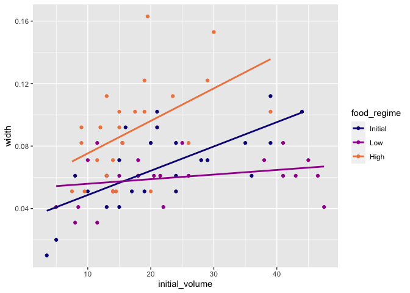
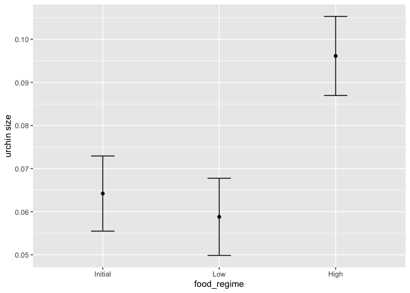
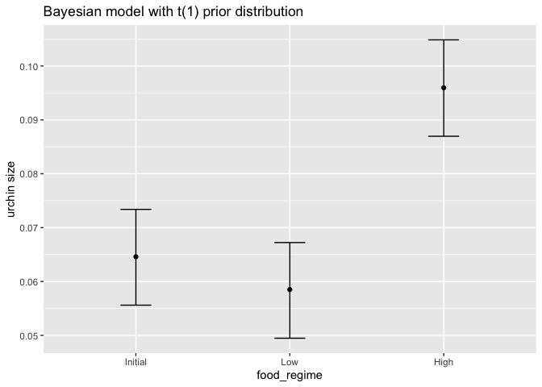

tidymodels Step 1: Build a model
================
Connor French
5/8/2020

Load packages

``` r
library(tidymodels)
library(readr)
```

Read in urchins data

``` r
urchins <-
  # Data were assembled for a tutorial 
  # at https://www.flutterbys.com.au/stats/tut/tut7.5a.html
  read_csv("https://tidymodels.org/start/models/urchins.csv") %>% 
  # Change the names to be a little more verbose
  setNames(c("food_regime", "initial_volume", "width")) %>% 
  # Factors are very helpful for modeling, so we convert one column
  mutate(food_regime = factor(food_regime, levels = c("Initial", "Low", "High")))
```

    ## Parsed with column specification:
    ## cols(
    ##   TREAT = col_character(),
    ##   IV = col_double(),
    ##   SUTW = col_double()
    ## )

Variables are: \* experimental feeding regime group `food_regime`
(`Initial`, `Low`, `High`) \* size in millimeters at the start of the
experiment (`initial_volume`), and \* suture width at the end of the
experiment (`width`)

Plotting the data

``` r
ggplot(urchins,
       aes(x = initial_volume, 
           y = width, 
           group = food_regime, 
           col = food_regime)) + 
  geom_point() + 
  geom_smooth(method = lm, se = FALSE) +
  scale_color_viridis_d(option = "plasma", end = .7)
```

    ## `geom_smooth()` using formula 'y ~ x'

<!-- -->

## Build and fit a model

Going to use a two-way ANOVA.

Formula:  
`width ~ initial_volume * food_regime`

Set the linear model engine

``` r
lm_mod <- 
  linear_reg() %>% 
  set_engine("lm")
```

Fit the model

``` r
lm_fit <- 
  lm_mod %>% 
  fit(width ~ initial_volume * food_regime, data = urchins)

lm_fit
```

    ## parsnip model object
    ## 
    ## Fit time:  27ms 
    ## 
    ## Call:
    ## stats::lm(formula = formula, data = data)
    ## 
    ## Coefficients:
    ##                    (Intercept)                  initial_volume  
    ##                      0.0331216                       0.0015546  
    ##                 food_regimeLow                 food_regimeHigh  
    ##                      0.0197824                       0.0214111  
    ##  initial_volume:food_regimeLow  initial_volume:food_regimeHigh  
    ##                     -0.0012594                       0.0005254

Use the **brooms** package’s nice `tidy` function to format output as a
tibble.

``` r
tidy(lm_fit)
```

    ## # A tibble: 6 x 5
    ##   term                            estimate std.error statistic  p.value
    ##   <chr>                              <dbl>     <dbl>     <dbl>    <dbl>
    ## 1 (Intercept)                     0.0331    0.00962      3.44  0.00100 
    ## 2 initial_volume                  0.00155   0.000398     3.91  0.000222
    ## 3 food_regimeLow                  0.0198    0.0130       1.52  0.133   
    ## 4 food_regimeHigh                 0.0214    0.0145       1.47  0.145   
    ## 5 initial_volume:food_regimeLow  -0.00126   0.000510    -2.47  0.0162  
    ## 6 initial_volume:food_regimeHigh  0.000525  0.000702     0.748 0.457

Predict to urchins with an initial volume of 20 ml.

``` r
new_points <- expand.grid(initial_volume = 20, 
                          food_regime = c("Initial", "Low", "High"))
new_points
```

    ##   initial_volume food_regime
    ## 1             20     Initial
    ## 2             20         Low
    ## 3             20        High

``` r
mean_pred <- predict(lm_fit, new_data = new_points)
mean_pred
```

    ## # A tibble: 3 x 1
    ##    .pred
    ##    <dbl>
    ## 1 0.0642
    ## 2 0.0588
    ## 3 0.0961

Confidence interval predictions with plot.

``` r
conf_int_pred <- predict(lm_fit, 
                         new_data = new_points, 
                         type = "conf_int")
conf_int_pred
```

    ## # A tibble: 3 x 2
    ##   .pred_lower .pred_upper
    ##         <dbl>       <dbl>
    ## 1      0.0555      0.0729
    ## 2      0.0499      0.0678
    ## 3      0.0870      0.105

``` r
# Now combine: 
plot_data <- 
  new_points %>% 
  bind_cols(mean_pred) %>% 
  bind_cols(conf_int_pred)

# and plot:
ggplot(plot_data, aes(x = food_regime)) + 
  geom_point(aes(y = .pred)) + 
  geom_errorbar(aes(ymin = .pred_lower, 
                    ymax = .pred_upper),
                width = .2) + 
  labs(y = "urchin size")
```

<!-- -->

## Model with a different engine

Contructing a Bayesian linear model.

``` r
# set the prior distribution
prior_dist <- rstanarm::student_t(df = 1)

set.seed(123)

# make the parsnip model
bayes_mod <-   
  linear_reg() %>% 
  set_engine("stan", 
             prior_intercept = prior_dist, 
             prior = prior_dist) 

# train the model
bayes_fit <- 
  bayes_mod %>% 
  fit(width ~ initial_volume * food_regime, data = urchins)

print(bayes_fit, digits = 5)
```

    ## parsnip model object
    ## 
    ## Fit time:  15.2s 
    ## stan_glm
    ##  family:       gaussian [identity]
    ##  formula:      width ~ initial_volume * food_regime
    ##  observations: 72
    ##  predictors:   6
    ## ------
    ##                                Median   MAD_SD  
    ## (Intercept)                     0.03495  0.00932
    ## initial_volume                  0.00148  0.00038
    ## food_regimeLow                  0.01725  0.01244
    ## food_regimeHigh                 0.01835  0.01409
    ## initial_volume:food_regimeLow  -0.00117  0.00048
    ## initial_volume:food_regimeHigh  0.00065  0.00067
    ## 
    ## Auxiliary parameter(s):
    ##       Median  MAD_SD 
    ## sigma 0.02121 0.00182
    ## 
    ## ------
    ## * For help interpreting the printed output see ?print.stanreg
    ## * For info on the priors used see ?prior_summary.stanreg

Look at the parameters table

``` r
tidy(bayes_fit, intervals = TRUE)
```

    ## # A tibble: 6 x 5
    ##   term                            estimate std.error     lower     upper
    ##   <chr>                              <dbl>     <dbl>     <dbl>     <dbl>
    ## 1 (Intercept)                     0.0349    0.00932   0.0197    0.0504  
    ## 2 initial_volume                  0.00148   0.000376  0.000840  0.00212 
    ## 3 food_regimeLow                  0.0172    0.0124   -0.00411   0.0380  
    ## 4 food_regimeHigh                 0.0183    0.0141   -0.00434   0.0419  
    ## 5 initial_volume:food_regimeLow  -0.00117   0.000480 -0.00198  -0.000339
    ## 6 initial_volume:food_regimeHigh  0.000652  0.000667 -0.000475  0.00177

Plot predictions

``` r
bayes_plot_data <- 
  new_points %>% 
  bind_cols(predict(bayes_fit, new_data = new_points)) %>% 
  bind_cols(predict(bayes_fit, new_data = new_points, type = "conf_int"))

ggplot(bayes_plot_data, aes(x = food_regime)) + 
  geom_point(aes(y = .pred)) + 
  geom_errorbar(aes(ymin = .pred_lower, ymax = .pred_upper), width = .2) + 
  labs(y = "urchin size") + 
  ggtitle("Bayesian model with t(1) prior distribution")
```

<!-- -->
